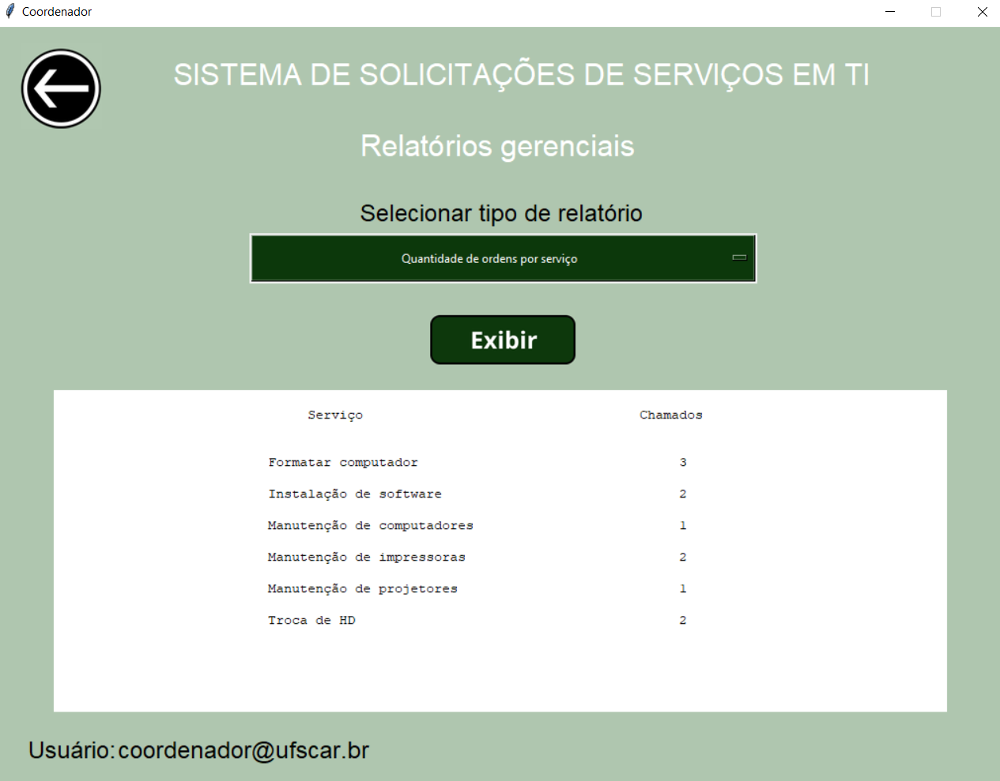

# Sistema de Chamados de Serviços em TI

Esse protótipo foi desenvolvido como projeto de conclusão da disciplina de sistemas de informações gerenciais do curso de engenharia de produção da Universidade Federal de São Carlos (UFSCar).

## Motivação e Funcionalidades

A proposta do projeto era desenvolver um software que gerenciasse as solicitações de serviços de 
tecnologia da informação realizados dentro do Departamento de Engenharia de Produção. O sistema deveria 
apresentar aos solicitantes uma fila de solicitações, organizá-la por prioridade de atendimento e permitir
acompanhar o andamento das solicitações em tempo real. Os técnicos de informática, responsáveis pelo atendimento do serviço,
poderiam acompanhar todas as demandas em andamento, as concluídas, e ainda atualizar informações relevantes, principalmente
o status do atendimento do chamado. O último ator do sistema é o coordenador de informática, que além das funcionalidades dos solicitantes
ainda pode consultar relatórios contendo informações gerenciais.

Todas as funcionalidades resumidas acima estão descritas no diagrama de casos de uso ([DCU](https://github.com/lucasgmalheiros/sistema-chamados-TI/blob/main/DCU.png)).

## Desenvolvimento

As ferramentas utilizadas foram: Figma, para design da interface gráfica, MySQL, como banco de dados, e Python, para programação
de todo o software. O projeto [Tkinter-Designer](https://github.com/ParthJadhav/Tkinter-Designer) 
foi fundamental para agilizar a modelagem gráfica da interface em Python, gerando os códigos das telas pela biblioteca Tkinter,
integrando-se à API do Figma.

## Funcionamento
Para utilizar o protótipo basta criar um banco de dados em MySQL com o modelo físico presente no arquivo [modelo-banco](modelo-banco.txt) e realizar a conexão com o Python, alterando os argumentos contidos na funcão [ConectaBanco](conecta_banco.py).
A partir daí, basta executar [telas.py](telas.py) para utilizar a interface gráfica, os usuários já podem ser cadastrados pela GUI 
e todas as informações do sistema serão atualizadas no banco de dados.

## Telas
Alguns exemplos de telas e funcionamento da aplicação.

### Tela de login geral
Todos os usuários podem se cadastrar ou realizar login por essa tela. De acordo com a função cadastrada, o usuário é direcionado para uma tela principal com as funcionalidades disponíveis para seu cargo.

### Solicitantes
#### Tela principal

#### Acompanhar solicitações
Apresenta as solicitações em aberto realizadas apenas por este usuário.

### Técnicos de informática
#### Tela principal

#### Acompanhar solicitações
Apresenta todas as solicitações em aberto (realizadas por todos os usuários) ordenadas de acordo com a prioridade. 

### Coordenador de informática
#### Tela principal

#### Relatórios gerenciais
Oferece opções de relatórios gerenciais do estado atual do sistema que são apresentados tanto na tela como em uma planilha eletrônica.

